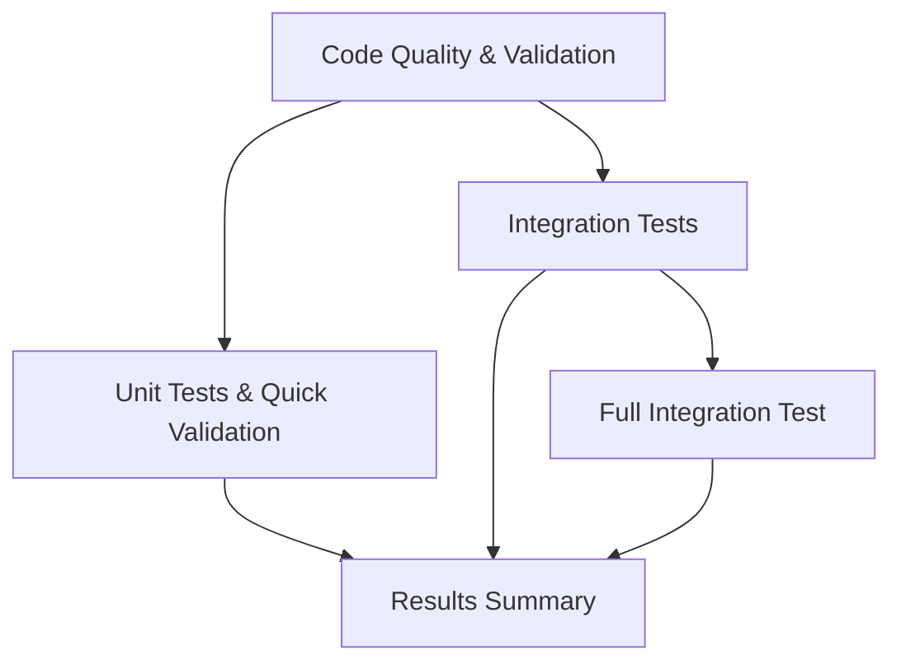

# CI/CD Integration Guide

This guide covers the continuous integration and deployment setup for the N8N Self-Hosted Installer using GitHub Actions and the Task-based architecture.

## 🚀 CI Pipeline Overview

The CI pipeline uses a **multi-stage architecture** with proper dependencies and parallel execution where possible.

### Pipeline Stages



## 📋 Pipeline Configuration

### Main CI Pipeline (`.github/workflows/ci-pipeline.yml`)

**Triggers:**
- Push to `main`, `develop`, `feature/*` branches
- Pull requests to `main`
- Manual dispatch with test level selection

**Stages:**

#### 1. **Code Quality & Validation**
- ✅ Task structure validation
- ✅ Task syntax validation  
- ✅ ShellCheck linting
- ✅ Documentation validation
- 🏗️ Creates cache for Task binary

#### 2. **Unit Tests & Quick Validation**
- ✅ Task function tests
- ✅ Quick validation suite
- ✅ Security validation
- ⚡ Uses cached Task binary

#### 3. **Integration Tests**
- ✅ Ubuntu 20.04 and 22.04 container tests
- ✅ Task functionality in isolated environments
- ✅ Dry-run validation
- 🔄 Matrix strategy for multiple OS versions

#### 4. **Full Integration Test** (Manual dispatch only)
- 🖥️ Complete VM-based testing with Multipass
- ⚙️ Full installation test
- 🧪 End-to-end validation
- ⏰ 30-minute timeout

#### 5. **Results Summary**
- 📊 Comprehensive results reporting
- ✅ Pass/fail status for all stages
- 🚫 Fails pipeline if critical stages fail

### Badge Updates (`.github/workflows/badges.yml`)

- 🏷️ Updates status badges automatically
- 🔄 Triggered by CI pipeline completion
- 📈 Reflects current build status

## 🔧 Task-Based Testing

### CI-Friendly Test Commands

All test commands are designed to work in CI environments without failing when services aren't installed:

```bash
# Code quality
task test:lint          # ShellCheck validation
task test:syntax        # YAML syntax validation

# Functionality  
task test:functions     # Basic task functionality
task test:quick         # Quick validation suite

# System tests (CI-aware)
task test:health-check  # Health check with CI mode
task test:connectivity  # Connectivity tests with CI mode
task test:security      # Security validation with CI mode
```

### CI Mode Detection

Tests automatically detect CI environment using `CI` environment variable:

```bash
CI_MODE="${CI:-false}"

if [ "$CI_MODE" = "true" ]; then
    echo "ℹ️ Expected in CI environment"
    # Don't fail on missing services
else
    # Fail on production issues
    ERRORS=$((ERRORS + 1))
fi
```

## 🎯 Test Strategy

### Critical Tests (Must Pass)
- ✅ **Code Quality**: Linting and syntax validation
- ✅ **Unit Tests**: Basic functionality validation
- ✅ **Integration Tests**: Container-based testing

### Optional Tests (Non-blocking)
- 🖥️ **Full Integration**: Only on manual dispatch

### Matrix Testing
- 🐧 **Ubuntu 20.04**: LTS baseline
- 🐧 **Ubuntu 22.04**: Current LTS
- 🔄 **Parallel execution**: Faster feedback

## 🛠️ Local Development

### Running CI Tests Locally

```bash
# Simulate CI environment
export CI=true

# Run the same tests as CI
task test:lint
task test:syntax
task test:functions
task test:quick

# Test in container (requires Docker)
docker run --rm -v "$(pwd):/workspace" -w /workspace ubuntu:22.04 bash -c "
  apt-get update && apt-get install -y curl git sudo lsb-release python3 python3-yaml &&
  curl -sL https://taskfile.dev/install.sh | sh -s -- -b /usr/local/bin &&
  /usr/local/bin/task test:syntax
"
```

### Pre-commit Testing

Create `.git/hooks/pre-commit`:
```bash
#!/bin/bash
echo "🔍 Running pre-commit tests..."
export CI=true
task test:lint && task test:syntax && task test:functions
```

## 🔒 Security Considerations

### Secrets Management
- 🔐 No secrets required for basic CI
- 🛡️ VM tests run in isolated environments
- 🧹 Automatic cleanup of test resources

### Permissions
- 📝 **Read permissions**: Repository content
- 🏃 **Execute permissions**: Test commands only
- 🚫 **No write permissions**: To production systems

### Isolation
- 🐳 **Container isolation**: Each test runs in clean environment
- 🖥️ **VM isolation**: Full integration tests use disposable VMs
- 🧹 **Cleanup**: Automatic resource cleanup after tests

## 📊 Performance Optimization

### Caching Strategy
- 📦 **Task binary caching**: Avoid repeated downloads
- ⚡ **Cache key**: Based on Task configuration files
- 🔄 **Cache invalidation**: When Task files change

### Parallel Execution
- 🔀 **Stage parallelization**: Independent stages run simultaneously
- 🌊 **Matrix jobs**: Multiple OS versions test in parallel
- ⚡ **Fast feedback**: Critical tests complete quickly

### Resource Management
- ⏰ **Timeouts**: Prevent hung jobs (30min max)
- 💾 **Resource limits**: Controlled resource usage
- 🧹 **Cleanup**: Automatic cleanup prevents resource leaks

## 🔍 Monitoring & Debugging

### CI Status Monitoring
- 🏷️ **Status badges**: Real-time pipeline status
- 📧 **Notifications**: Automatic failure notifications
- 📊 **Trends**: Historical success/failure rates

### Debugging Failed Builds
```bash
# View detailed logs
gh run view --log

# Re-run failed jobs
gh run rerun --failed

# Download artifacts for inspection
gh run download
```

### Common Issues

**Task installation fails**:
```yaml
- name: Debug Task installation
  run: |
    curl -sL https://taskfile.dev/install.sh | sh -s -- -d -b /tmp
    /tmp/task --version
```

**Permission issues**:
```yaml
- name: Fix permissions
  run: |
    sudo chown -R $USER:$USER .
    chmod +x scripts/*.sh
```

**Container connectivity**:
```bash
# Test container networking
docker run --rm ubuntu:22.04 bash -c "ping -c 1 google.com"
```

## 🚀 Deployment Integration

### Automated Releases
- 🏷️ **Version tagging**: Automatic version detection
- 📦 **Artifact creation**: Release packages
- 📋 **Release notes**: Generated from CHANGELOG.md

### Release Pipeline (Future)
```yaml
release:
  if: github.ref == 'refs/heads/main' && contains(github.event.head_commit.message, 'release:')
  steps:
    - name: Create release
      uses: actions/create-release@v1
```

### Deployment Validation
- ✅ **Pre-deployment**: All tests must pass
- 🧪 **Staging deployment**: Test environment validation
- 🚀 **Production deployment**: Gradual rollout

## 📚 Best Practices

### Workflow Design
- 🎯 **Fail fast**: Critical tests run first
- 🔄 **Incremental**: Each stage builds on previous
- 📊 **Comprehensive**: Multiple validation layers

### Test Design  
- 🔧 **Deterministic**: Consistent results across runs
- 🌐 **Environment agnostic**: Works in any CI environment
- 🧹 **Self-contained**: No external dependencies

### Maintenance
- 📅 **Regular updates**: Keep actions and tools updated
- 🔍 **Regular review**: Monitor and optimize performance
- 📊 **Metrics tracking**: Success rates and execution times

---

**Next Steps**:
- Monitor CI pipeline performance
- Add additional security scanning
- Implement automated deployment pipeline
- Enhance test coverage metrics